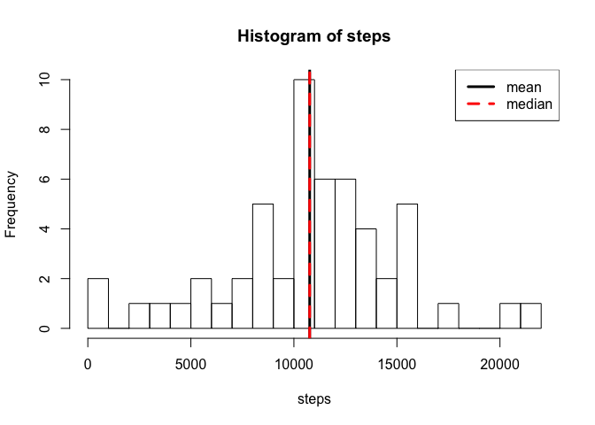
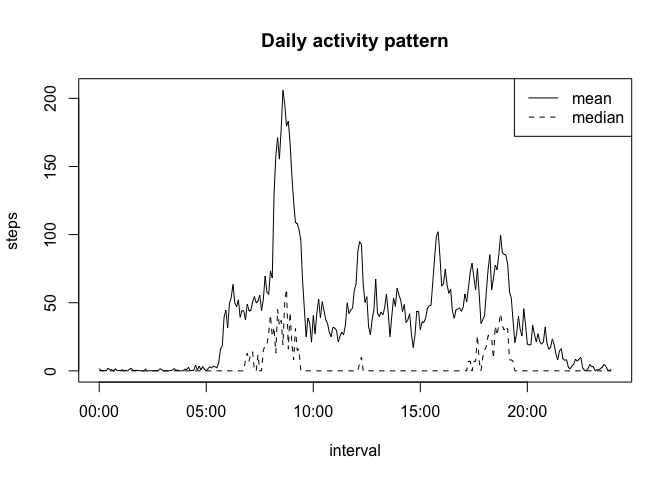
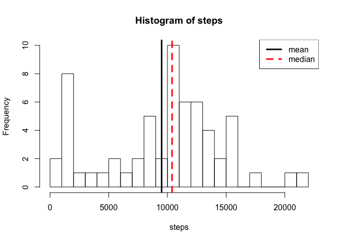
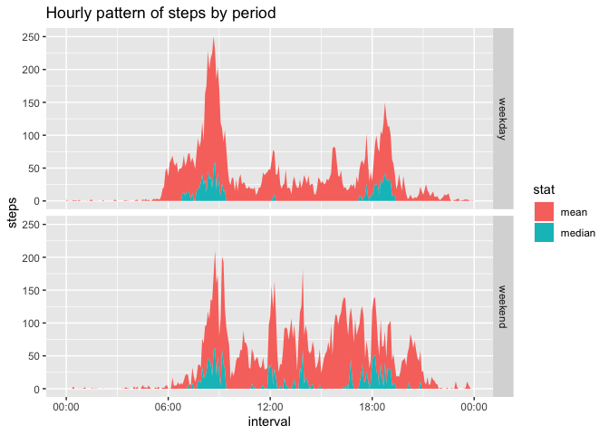

Data Science Specialisation, Course 5, assignment 1
===================================================

HCS’ assignment 1 for Reproductible Research course

Loading and preprocessing the data
----------------------------------

### Downloading data if necessary

The following chunk of code evaluates if the data files are already
present. If not, it will download the data, uncompress it, and then
remove the compressed file that is no longer necessary.

    file_url <- "https://d396qusza40orc.cloudfront.net/repdata%2Fdata%2Factivity.zip"
    file_zip <- "repdata%2Fdata%2Factivity.zip"
    file_unzip <- c("activity.csv")

    if (!all(file.exists(file_unzip))) { 
      if (!file.exists(file_zip)) { download.file(file_url,destfile=file_zip,mode="wb") }
      unzip(file_zip)
      file.remove(file_zip)
    }

### Loading and cleaning the data

The following section reads the row data, and then transforms the
columns concerning time measures into a time format suitable for R. We
will also take a look on how the data looks like.

    data <- read.csv(file_unzip)
    data$date <- as.Date(data$date)
    data$interval <- as.POSIXct(sprintf("%04d",data$interval),format="%H%M")
    str(data)

    ## 'data.frame':    17568 obs. of  3 variables:
    ##  $ steps   : int  NA NA NA NA NA NA NA NA NA NA ...
    ##  $ date    : Date, format: "2012-10-01" "2012-10-01" ...
    ##  $ interval: POSIXct, format: "2019-12-04 00:00:00" "2019-12-04 00:05:00" ...

As we can notice, the data$interval column contains the intervals of
time as if they were for the current day. Since this part of the data is
only used to group and compare intervals of time regardless the date, we
will ignore the fact that the date doesn’t match that on the data$date
column.

What is mean total number of steps taken per day?
-------------------------------------------------

### Summarise data

First, we will report the total number of steps per day using the dplyr
library. The data us grouped by date (day) and the sum of steps for each
day is calculated. This is stored in the variable steps.perday.

    library(dplyr)

    steps.perday <- data %>% group_by(date) %>% summarise(steps=sum(steps,na.rm=T))
    steps.perday$steps[steps.perday$steps==0] <- NA
    head(steps.perday)

    ## # A tibble: 6 x 2
    ##   date       steps
    ##   <date>     <int>
    ## 1 2012-10-01    NA
    ## 2 2012-10-02   126
    ## 3 2012-10-03 11352
    ## 4 2012-10-04 12116
    ## 5 2012-10-05 13294
    ## 6 2012-10-06 15420

Then the number of steps per day is summarised and stored in the
variable steps.summary, which shows the mean and the median.

    steps.summary <- summary(steps.perday$steps,na.rm=T)
    steps.summary

    ##    Min. 1st Qu.  Median    Mean 3rd Qu.    Max.    NA's 
    ##      41    8841   10765   10766   13294   21194       8

### Make plot

The following code generates a histogram of the number of steps per day,
along with the mean and median.

    with(steps.perday, {
      hist(steps,breaks=25)
      abline(v=mean(steps,na.rm=T),lty=1,lwd=3)
      abline(v=median(steps,na.rm=T),lty=2,lwd=3,col="red")
      legend("topright",lwd=3,lty=c(1,2),col=c("black","red"),legend=c("mean","median"))})

What is the average daily activity pattern?
-------------------------------------------

This section summarises the data by intervals of time across days and
saves it in the variable steps.pertime. This variable is then used to
plot the mean and median number of steps for each interval.

    steps.pertime <- data %>% group_by(interval) %>%
      summarise(median=median(steps,na.rm=T),mean=mean(steps,na.rm=T))

    with(steps.pertime, {
      plot(mean~interval,type="l",xlab="interval",ylab="steps",main="Daily activity pattern")
      lines(median~interval,lty=2)
      legend('topright',legend=c("mean","median"),lty=c(1,2))})

The hour at which the maximum mean number of step is reported is the
following:

    maxhour <- steps.pertime %>% filter(mean==max(mean)) %>% select(interval)
    maxhour <- format(maxhour$interval[1],"%H:%M")
    maxhour

    ## [1] "08:35"

As can be seen, the peak hour is at 08:35.

Imputing missing values
-----------------------

Since some data is missing from the dataset, we will first impute the
missing data.

### Explore missing data

First we explore how the NA values are distributed by measuring the
percentage of NA observations per day. We start by counting the NA
values:

    sum(is.na(data$steps))

    ## [1] 2304

Then we explore the data:

    data.na <- with(data, tapply(steps,date,function(x) mean(is.na(x))))
    data.naT <- sum(data.na)
    data.na

    ## 2012-10-01 2012-10-02 2012-10-03 2012-10-04 2012-10-05 2012-10-06 2012-10-07 
    ##          1          0          0          0          0          0          0 
    ## 2012-10-08 2012-10-09 2012-10-10 2012-10-11 2012-10-12 2012-10-13 2012-10-14 
    ##          1          0          0          0          0          0          0 
    ## 2012-10-15 2012-10-16 2012-10-17 2012-10-18 2012-10-19 2012-10-20 2012-10-21 
    ##          0          0          0          0          0          0          0 
    ## 2012-10-22 2012-10-23 2012-10-24 2012-10-25 2012-10-26 2012-10-27 2012-10-28 
    ##          0          0          0          0          0          0          0 
    ## 2012-10-29 2012-10-30 2012-10-31 2012-11-01 2012-11-02 2012-11-03 2012-11-04 
    ##          0          0          0          1          0          0          1 
    ## 2012-11-05 2012-11-06 2012-11-07 2012-11-08 2012-11-09 2012-11-10 2012-11-11 
    ##          0          0          0          0          1          1          0 
    ## 2012-11-12 2012-11-13 2012-11-14 2012-11-15 2012-11-16 2012-11-17 2012-11-18 
    ##          0          0          1          0          0          0          0 
    ## 2012-11-19 2012-11-20 2012-11-21 2012-11-22 2012-11-23 2012-11-24 2012-11-25 
    ##          0          0          0          0          0          0          0 
    ## 2012-11-26 2012-11-27 2012-11-28 2012-11-29 2012-11-30 
    ##          0          0          0          0          1

As shown above, 8 days have 100% NA values, while others only have
complete observations.

### Fill missing data with median from other days

The days with missing data can be imputed with the calculated median for
all the other days, by intervals, as shown in the code above:

    data.imputed <- data
    data.imputed$steps[is.na(data.imputed$steps)] <- rep(steps.pertime$median,
                                  sum(with(data, tapply(steps,date,function(x) mean(is.na(x))))))
    steps.perday.imp <- data.imputed %>% group_by(date) %>% summarise(steps=sum(steps,na.rm=T))
    steps.summary.imp <- summary(steps.perday.imp$steps,na.rm=T)
    steps.summary.imp

    ##    Min. 1st Qu.  Median    Mean 3rd Qu.    Max. 
    ##      41    6778   10395    9504   12811   21194

As we can see, both the median and the mean of the imputed data differ
from the original.

### Histogram and summary of imputed data

As we did before for the original data, we can visualise a histogram of
the total number of steps per day for imputed data along with the mean
and median.

    with(steps.perday.imp, {
      hist(steps,breaks=25)
      abline(v=mean(steps,na.rm=T),lty=1,lwd=3)
      abline(v=median(steps,na.rm=T),lty=2,lwd=3,col="red")
      legend("topright",lwd=3,lty=c(1,2),col=c("black","red"),legend=c("mean","median"))})

As shown, imputing the data affects both the mean and the median.

Are there differences in activity patterns between weekdays and weekends?
-------------------------------------------------------------------------

### Creating period variable

In order to discriminate between the measures that occur during weekdays
from those that occur during the weekend, we create a new column called
period. We will also explore the data in order to check it.

    data.imputed$period <- factor(ifelse(as.POSIXlt(data$date)$wday %in% 1:5,"weekday","weekend"))
    str(data.imputed)

    ## 'data.frame':    17568 obs. of  4 variables:
    ##  $ steps   : int  0 0 0 0 0 0 0 0 0 0 ...
    ##  $ date    : Date, format: "2012-10-01" "2012-10-01" ...
    ##  $ interval: POSIXct, format: "2019-12-04 00:00:00" "2019-12-04 00:05:00" ...
    ##  $ period  : Factor w/ 2 levels "weekday","weekend": 1 1 1 1 1 1 1 1 1 1 ...

We can also take a look on the summary of the enriched data just to
observe if there are obvious differences by period of the week.

    with(data.imputed, tapply(steps,period,summary))

    ## $weekday
    ##    Min. 1st Qu.  Median    Mean 3rd Qu.    Max. 
    ##    0.00    0.00    0.00   31.15    5.00  806.00 
    ## 
    ## $weekend
    ##    Min. 1st Qu.  Median    Mean 3rd Qu.    Max. 
    ##    0.00    0.00    0.00   38.19   17.25  785.00

### Summarise

Finally, we will summarise the new data. For this, we will group the
data by period and interval, summarise the mean and median, and reformat
the dataframe so it is easier to plot later. This will require the tidyr
package. We will also and take a look on the first lines of the
reorganised data.

    library(tidyr)
    steps.pertime.week <- data.imputed %>% group_by(period,interval) %>%
      summarise(median=median(steps,na.rm=T),mean=mean(steps,na.rm=T)) %>%
      gather("mean":"median",key="stat",value="steps")
    head(steps.pertime.week)

    ## # A tibble: 6 x 4
    ## # Groups:   period [2]
    ##   period  interval            stat   steps
    ##   <fct>   <dttm>              <chr>  <dbl>
    ## 1 weekday 2019-12-04 00:00:00 mean  2.02  
    ## 2 weekday 2019-12-04 00:05:00 mean  0.4   
    ## 3 weekday 2019-12-04 00:10:00 mean  0.156 
    ## 4 weekday 2019-12-04 00:15:00 mean  0.178 
    ## 5 weekday 2019-12-04 00:20:00 mean  0.0889
    ## 6 weekday 2019-12-04 00:25:00 mean  1.31

### Plot the final data

Finally, we will plot both the mean and the median of each period of the
week using the package ggplot2.

    library(ggplot2)
    g <- ggplot(steps.pertime.week,aes(x=interval,y=steps))
    g + geom_area(aes(fill=stat)) + ggtitle("Hourly pattern of steps by period") +
      facet_grid(period~.) + scale_x_datetime(date_labels="%H:%M")

 As we
can observe, the distribution of the median and mean steps per period of
time changes in function of the period of the week.
